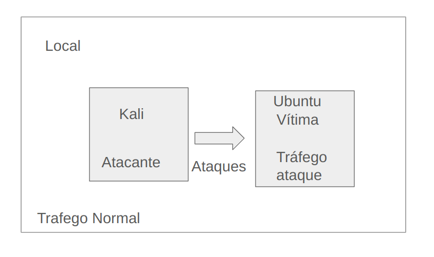
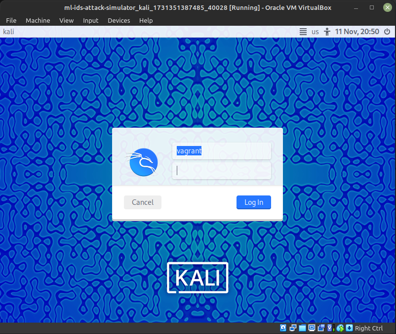

# ml-ids-attack-simulator

Este repositório é destinado a criar dados simulados de ataques para construção de IDS

## Estrutura

A ideia deste repositorio é criar um ambiente para simulação de ataques, baseado em VMs (virtual machines) dentro da mesma rede, no qual temos uma VM atacante e uma VM atacada.

Para coleta de dados de fluxos normais (sem ataques), estes serão coletados na maquina local.



## Pre-requisitos

- Oracle Virtual box 7.0 (https://www.virtualbox.org)
- Vagrant >=2.4.1  (https://www.vagrantup.com)
- Docker  >= 27.3.1 (https://docs.docker.com/engine/install/)

## Etapas

1) Criar as maquinas virtuais
2) Coletar os dados locais
3) Coletar os dados da VM atacada (ou vítima)
4) Iniciar os ataques

### Criar as maquinas virtuais

Basta executar o comando

```
$ vagrant up
```

Neste momento serão criados 2 VMs, uma com o Kali linux, que será a atacante. Este irá abrir uma nova janela pedindo usuário e senha que é **vagrant** para ambos.



A outra vm criada é um ubuntu 16 com o apache web server instalado, sendo esta a atacada ou vítima e poderá ser acessada através do comando (esta não abrirá nenhuma janela nova)

```
$ vagrant ssh ubuntu16
```

Exemplo:
```
➜  ml-ids-attack-simulator git:(main) ✗ vagrant ssh ubuntu16
Welcome to Ubuntu 16.04.7 LTS (GNU/Linux 4.4.0-210-generic x86_64)

 * Documentation:  https://help.ubuntu.com
 * Management:     https://landscape.canonical.com
 * Support:        https://ubuntu.com/pro

Expanded Security Maintenance for Infrastructure is not enabled.

0 updates can be applied immediately.

200 additional security updates can be applied with ESM Infra.
Learn more about enabling ESM Infra service for Ubuntu 16.04 at
https://ubuntu.com/16-04

New release '18.04.6 LTS' available.
Run 'do-release-upgrade' to upgrade to it.


Last login: Mon Nov 11 18:57:43 2024 from 10.0.2.2
-bash: warning: setlocale: LC_CTYPE: cannot change locale (pt_BR.UTF-8): No such file or directory
vagrant@ubuntu-xenial:~$
```

### Coleta de dados locais

A coleta de dados da maquina local é realizada para captura de dados de fluxos normais. **Muito cuidado com esta etapa pois serão capturadas informações da sua rede como endereços de ips e paginas visitadas**. Após a coleta dos dados é necesario fazer uma anonimização destes dados.

Para executar a coleta primeiramente devemos trocar no arquivo *get-flow.py* a palavra *rede* para interface de rede local da sua maquina. Para isto execute o comando

```
$ ifconfig
```

Exemplo:

```
br-ff73f8fa2eae: flags=4099<UP,BROADCAST,MULTICAST>  mtu 1500
        inet 172.18.0.1  netmask 255.255.0.0  broadcast 172.18.255.255
        RX packets 0  bytes 0 (0.0 B)
        RX errors 0  dropped 0  overruns 0  frame 0
        TX packets 0  bytes 0 (0.0 B)
        TX errors 0  dropped 0 overruns 0  carrier 0  collisions 0

docker0: flags=4099<UP,BROADCAST,MULTICAST>  mtu 1500
        inet 172.17.0.1  netmask 255.255.0.0  broadcast 172.17.255.255
        RX packets 22534  bytes 1218433 (1.2 MB)
        RX errors 0  dropped 0  overruns 0  frame 0
        TX packets 44537  bytes 71349934 (71.3 MB)
        TX errors 0  dropped 0 overruns 0  carrier 0  collisions 0

enp9s0: flags=4163<UP,BROADCAST,RUNNING,MULTICAST>  mtu 1500
        inet 192.168.0.100  netmask 255.255.255.0  broadcast 192.168.0.255
        ether 3c:7c:3f:7c:4b:3b  txqueuelen 1000  (Ethernet)
        RX packets 18083597  bytes 15420472993 (15.4 GB)
        RX errors 0  dropped 0  overruns 0  frame 0
        TX packets 9591298  bytes 4193171594 (4.1 GB)
        TX errors 0  dropped 0 overruns 0  carrier 0  collisions 0

lo: flags=73<UP,LOOPBACK,RUNNING>  mtu 65536
        inet 127.0.0.1  netmask 255.0.0.0
        loop  txqueuelen 1000  (Local Loopback)
        RX packets 413446  bytes 40541720 (40.5 MB)
        RX errors 0  dropped 0  overruns 0  frame 0
        TX packets 413446  bytes 40541720 (40.5 MB)
        TX errors 0  dropped 0 overruns 0  carrier 0  collisions 0
```

Devemos pegar a rede local que geralmente é a 192.168.x.x, que no exemplo é a *enp9s0* logo o arquivo *get-flow.py* deve ficar assim

```
from nfstream import NFStreamer

online_streamer = NFStreamer(source="enp9s0", statistical_analysis = True, idle_timeout=60, active_timeout=600)

total_flows_count = online_streamer.to_csv(path="same_attacks.csv", columns_to_anonymize=[], flows_per_file=0, rotate_files=0)
```

**É muito importante editar e trocar corretamente o nome antes de buildar e executar a imagem!**

Após editado o arquivo buildar a imagem docker

```
sudo docker build -t collect_attacks .
```

Agora basta somente executar

```
sudo docker run -d --network host --user root --rm -v "${PWD}":/home/python/ collect_attacks
```

Após alguns minutos deve aparecer na pasta deste projeto um arquivo chamado *same_attacks.csv*, este arquivo contem os fluxos de dados gerados através dos pacotes de redes, na qual foi utilizada a ferramenta NFstream (https://www.nfstream.org), nele encontramos mais detalhes da criação desses arquivos.

### Coletar os dados da VM atacada (ou vítima)

Primeramente devemos entrar na maquina a ser atacada

```
$ vagrant ssh ubuntu16
```

Após dentro da VM executar os passos da etapa anterior

1) Editar o arquivo get-flow.py e trocar *rede* pela interface de rede local

Exemplo:
```
vagrant@ubuntu-xenial:~$ ifconfig
docker0   Link encap:Ethernet  HWaddr 02:42:30:23:d6:2f
          inet addr:172.17.0.1  Bcast:172.17.255.255  Mask:255.255.0.0
          inet6 addr: fe80::42:30ff:fe23:d62f/64 Scope:Link
          UP BROADCAST MULTICAST  MTU:1500  Metric:1
          RX packets:21289 errors:0 dropped:0 overruns:0 frame:0
          TX packets:44245 errors:0 dropped:0 overruns:0 carrier:0
          collisions:0 txqueuelen:0
          RX bytes:897111 (897.1 KB)  TX bytes:70794584 (70.7 MB)

enp0s3    Link encap:Ethernet  HWaddr 02:be:82:6b:cc:1d
          inet addr:10.0.2.15  Bcast:10.0.2.255  Mask:255.255.255.0
          inet6 addr: fe80::be:82ff:fe6b:cc1d/64 Scope:Link
          UP BROADCAST RUNNING MULTICAST  MTU:1500  Metric:1
          RX packets:51157 errors:0 dropped:0 overruns:0 frame:0
          TX packets:24416 errors:0 dropped:0 overruns:0 carrier:0
          collisions:0 txqueuelen:1000
          RX bytes:71310993 (71.3 MB)  TX bytes:1751755 (1.7 MB)

enp0s8    Link encap:Ethernet  HWaddr 08:00:27:c6:7d:f2
          inet addr:192.168.0.148  Bcast:192.168.0.255  Mask:255.255.255.0
          UP BROADCAST RUNNING MULTICAST  MTU:1500  Metric:1
          RX packets:1247316 errors:0 dropped:0 overruns:0 frame:0
          TX packets:115384 errors:0 dropped:0 overruns:0 carrier:0
          collisions:0 txqueuelen:1000
          RX bytes:1287039569 (1.2 GB)  TX bytes:9998727 (9.9 MB)

lo        Link encap:Local Loopback
          inet addr:127.0.0.1  Mask:255.0.0.0
          inet6 addr: ::1/128 Scope:Host
          UP LOOPBACK RUNNING  MTU:65536  Metric:1
          RX packets:0 errors:0 dropped:0 overruns:0 frame:0
          TX packets:0 errors:0 dropped:0 overruns:0 carrier:0
          collisions:0 txqueuelen:1
          RX bytes:0 (0.0 B)  TX bytes:0 (0.0 B)

vagrant@ubuntu-xenial:~$ vi get-flow.py

from nfstream import NFStreamer

online_streamer = NFStreamer(source="enp0s8", statistical_analysis = True, idle_timeout=60, active_timeout=600)

total_flows_count = online_streamer.to_csv(path="same_attacks.csv", columns_to_anonymize=[], flows_per_file=0, rotate_files=0)

```

É muito importante anotar o IP dessa VM, pois este será o IP que será atacado, para este exemplo: 192.168.0.148.

2) buildar a imagem docker.

```
sudo docker build -t collect_attacks .
```

3) Executar a imagem.
```
sudo docker run -d --network host --user root --rm -v "${PWD}":/home/python/ collect_attacks
```

Após tudo executado e esperado alguns minutos deve ter sido criado um arquivo chamado *same_atacks.csv*, caso contrario houve algum problema.

### Iniciar os ataques

Após todos os passos anteriores daremos inicio as ataques.

Primeiramente entre na VM linux com o usuario e senha citados e abra um terminal execute o comando:

```
$ ifconfig
```

**E anote o IP desta VM é muito importante esse passo**

Anotado o IP é muito importante para cada ataque anotar a data e hora exata do inicio e fim deste. Alguns só terminam caso interrompa com o comando *Ctrl+c*, minha recomendação é deixar de 5 a 15 minutos cada ataque (exceto o nmap, este deixar rodando tudo até acabar). Substituir *IP-atacado* pelo IP da maquina vítima (ubuntu16) Abaixo segue os ataques realizados,

#### DoS-Slowhttptest

```
slowhttptest -c 1000 -H -g -o slowhttp -i 10 -r 200 -t GET -u http://<IP-atacado> -x 24 -p 3
```

#### DoS-GoldenEye

https://github.com/jseidl/GoldenEye

```
$ cd GoldenEye
$ ./goldeneye.py http://<IP-atacado> -w 1 -s 10 -m get
```

#### DoS-Hulk

https://github.com/R3DHULK/HULK

```
$ cd HULK
$ python hulk.py
```
<IP-atacado>

#### DoS-slowloris

https://github.com/gkbrk/slowloris

```
slowloris <IP-atacado>
```

#### FTP-Patator

https://www.kali.org/tools/patator/
https://github.com/lanjelot/patator

```
patator ftp_login host=<IP-atacado> user=FILE0 0=top-usernames-shortlist.txt password=FILE1 1=darkweb2017-top10000.txt -x ignore:mesg='Login incorrect.' -x ignore,reset,retry:code=500
```

#### SSH-Patator

https://www.kali.org/tools/patator/
https://github.com/lanjelot/patator

```
patator ssh_login host=<IP-atacado> user=FILE0 0=top-usernames-shortlist.txt password=FILE1 1=darkweb2017-top10000.txt -x ignore:mesg='Authentication failed.'
```

#### nmap

```
sudo nmap -sS <IP-atacado>
sudo nmap -sT <IP-atacado>
sudo nmap -sF <IP-atacado>
sudo nmap -sX <IP-atacado>
sudo nmap -sN <IP-atacado>
sudo nmap -sP <IP-atacado>
sudo nmap -sV <IP-atacado>
sudo nmap -sU <IP-atacado>
sudo nmap -sO <IP-atacado>
sudo nmap -sA <IP-atacado>
sudo nmap -sW <IP-atacado>
sudo nmap -sR <IP-atacado>
sudo nmap -sL <IP-atacado>
sudo nmap -B <IP-atacado>
```